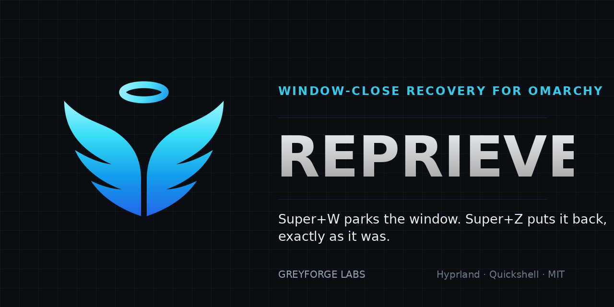

<p align="center">
  
</p>

<p align="center">
  <a href="https://github.com/GreyforgeLabs/reprieve/actions/workflows/test.yml"></a>
  <a href="https://github.com/GreyforgeLabs/reprieve/releases/latest"></a>
  <a href="LICENSE"></a>
  
</p>

<p align="center"><b>Every window deserves a second chance.</b></p>

Reprieve is an Omarchy plugin that gives `Super+W` a safety net. Instead of
terminating the window under your cursor, it tucks the running application
away on a hidden workspace and hands you a one-keystroke way back. The tabs,
the scrollback, the half-written message: untouched, because the process was
never asked to quit.

The scope is deliberately narrow. Reprieve guards one keystroke and makes it
reversible. It is built to keep that guarantee through `omarchy-shell`
restarts, plugin upgrades, and its own crashes.

## Sixty-second tour

```sh
omarchy plugin add https://github.com/GreyforgeLabs/reprieve.git --enable
```

A compact card appears the first time Reprieve loads without its shortcuts:

```text
Reprieve

Protect Super+W from accidental closes?

[ Enable Protection ]
```

Press it, and from then on:

| Keystroke        | Result                                                |
| ---------------- | ----------------------------------------------------- |
| `Super+W`        | Sends the focused window into reprieve (it lives on)  |
| `Super+Z`        | Returns the latest one to its home workspace           |
| `Super+Y`        | Sends it away again                                   |
| `Super+Shift+Z`  | Opens the recovery timeline                           |
| `Super+Alt+W`    | Terminates the focused window outright                |

Your applications' own `Ctrl+Z` is never touched. Requirements are a stock
Omarchy 4 install (Hyprland ≥ 0.56, Python 3 standard library, `hyprctl`,
`pactl`, `busctl`); there is nothing extra to install.

## Consent first

Turning the plugin on changes nothing on disk. The setup card is the
only path that writes to `~/.config/hypr/bindings.lua`, and pressing
**Enable Protection** (click, or Enter once the card has settled) does exactly
this:

1. Copies your `bindings.lua` to a timestamped backup.
2. Appends a single fenced block, `-- BEGIN tech.greyforge.reprieve` through
   `-- END tech.greyforge.reprieve`, via temp-file-and-rename so a crash
   mid-write cannot leave you with half a file.
3. Reloads Hyprland and confirms the shortcuts are actually live.
4. Symlinks `~/.local/bin/reprieve` to the CLI — unless something else already
   owns that path.

`Super+W` takes over Omarchy's default close binding; that is the whole
point. Every other shortcut is negotiated: if `Super+Z`, `Super+Y`, or
`Super+Shift+Z` is already yours, the card names the conflict and lets you
pick an alternate (`A`), overwrite it (`R`), or go without (Enter). A
`Super+W` you have customised yourself is left alone unless you explicitly
choose `R`.

Bring the card back any time with `reprieve setup`. Press `L` on it to opt
out permanently.

## Restore, not relaunch

Two outcomes exist in the timeline, and Reprieve is careful to tell them apart:

- **Restore** — the identical live window returns: same workspace, same
  tiled-or-floating state, same fullscreen mode, focus handed back, audio
  unpaused.
- **Reopen** — the window is gone (its process ended while hidden), but the
  application is on a short list that can be relaunched safely: Chrome,
  Chromium, Brave, Firefox, and Omarchy web apps. Only
  `omarchy-launch-browser` and `omarchy-launch-webapp https://<host>` are ever
  invoked. Reprieve does not record command lines and cannot replay one.

## The timeline

`Super+Shift+Z` shows everything Reprieve can bring back, most recent at the top.

| Row type      | Meaning                                                                 |
| ------------- | ----------------------------------------------------------------------- |
| **Parked**    | A live window Reprieve put on the hidden workspace                      |
| **Recovered** | A live window discovered on the hidden workspace after a reload, origin unknown; restoring lands it on your current workspace |
| **Reopen**    | Window gone, application relaunchable                                   |

Inside the overlay: **Enter** returns the row to its original workspace,
**Space** pulls it onto the one you are looking at, **A** returns everything,
**Y** re-parks the last one, **Del** twice on the same row terminates it for
good, **T** toggles the corner toast, **Esc** dismisses.

## The bar widget

Because `Super+W` now hides rather than destroys, the bar tells you where
things went. Reprieve's widget is placed in the right section on install and
has three parts:

- a status glyph that switches to your theme's alert colour whenever
  attention is needed — setup incomplete, shortcuts written but not loaded,
  or a hidden window with no timeline entry — and jumps you to the fix when
  clicked;
- one application icon per hidden window, newest first — left-click returns
  it home, right-click pulls it to the current workspace;
- a `+N` overflow once more windows are hidden than icons shown.

Left-click the glyph for the timeline, right-click to bring back the latest
window, middle-click to bring back all of them. The widget pulses when a
window is parked and fades out entirely when there is nothing to show.

```sh
reprieve bar status           # placement and toggles
reprieve bar hide-idle off    # stay visible even when idle
reprieve bar tray off         # glyph and count only
reprieve bar icons 8          # icons before collapsing to +N (1–10)
reprieve bar show off         # remove from the bar; the service keeps running
reprieve bar install center   # place it, or move it to another section
```

Moving to 1.1 from 1.0? Run `reprieve bar install` once; it relocates the
plugin's config entry into the bar layout using Omarchy's own enable/disable
cycle and carries your settings across.

## Built to survive its own failures

State lives in a small journal at `~/.local/state/reprieve/state.json`
(directory `0700`, file `0600`). It records the minimum needed to find a
hidden window again — address, home workspace, class, layout flags, pid,
ordering — plus which MPRIS players to unpause (and legacy mixer cleanup records). Titles,
command lines, and environment are never stored.

Each journal is tied to one Hyprland session. On every start Reprieve
cross-checks three sources — the journal, Hyprland's live client list, and the
actual contents of `special:reprieve` — then:

- rebuilds the timeline from the journal, in order;
- surfaces any untracked window sitting on the hidden workspace as **Recovered**;
- converts entries whose process has died into **Reopen** rows when the app
  qualifies, and drops the rest;
- sets aside a corrupt or foreign-session journal as `state.json.<reason>.<time>`
  and starts over from what is actually on screen.

A hidden window whose process exits later becomes a Reopen row or is removed
with a brief notice. Nothing stays hidden without a route back.

If `omarchy-shell` itself is down, `Super+W` and `Super+Alt+W` degrade to a
plain Hyprland close rather than doing nothing.

## Command line

```text
reprieve status          JSON: counts, hidden addresses, journal health
reprieve park            What Super+W runs
reprieve close           Terminate the focused window
reprieve undo            Return the most recently hidden window
reprieve redo            Hide it again
reprieve timeline        Open the timeline overlay
reprieve restore-all     Return every hidden window
reprieve clear           Forget history (refuses while anything is hidden)
reprieve reset           Return everything, then forget history
reprieve setup           Open the consent card
reprieve install-binds   Non-interactive install (--undo/--redo/--timeline KEY,
                         --skip a,b, --replace a,b)
reprieve remove-binds    Delete Reprieve's fenced block and nothing else
reprieve uninstall       Return hidden windows, then remove the shortcuts
reprieve bar ...         Widget placement and toggles (see above)
reprieve set KEY VALUE   Change a setting
reprieve doctor          Read-only health report
```

`reprieve doctor` inspects and never repairs:

```text
Reprieve Doctor

Hyprland         OK
Session          efb50993780079460b0cbe…
Plugin           OK
Journal          OK
Parked windows   2
Stranded         0
Bindings         OK
Conflicts        none
Media helper     OK

PASS
```

## Settings

Set with `reprieve set KEY VALUE`, or edit Reprieve's entry in
`~/.config/omarchy/shell.json` (under the bar layout once the widget is
placed, otherwise under `plugins[]`).

| Key                | Default | Effect                                                            |
| ------------------ | ------- | ----------------------------------------------------------------- |
| `maxStack`         | `10`    | How many windows may be hidden at once (1–20); the oldest is closed beyond that |
| `pauseMediaOnPark` | `true`  | Pause supported MPRIS players while hidden; audio without pause support keeps playing |
| `trackAppClose`    | `true`  | Turn title-bar closes of relaunchable apps into Reopen rows        |
| `showToast`        | `true`  | Corner notice on park and return (also **T** in the timeline)     |
| `showInBar`        | `true`  | Show the bar widget                                               |
| `barTray`          | `true`  | Per-window icons in the bar (off = glyph and count)               |
| `barMaxIcons`      | `5`     | Icons before collapsing into `+N` (1–10)                          |
| `hideBarWhenIdle`  | `true`  | Fade the widget out when nothing is hidden and nothing needs attention |

```json
{ "id": "tech.greyforge.reprieve", "maxStack": 10, "pauseMediaOnPark": true, "barTray": true }
```

Parking uses media-player pause controls; it does not change application mute
or volume. Players without MPRIS pause support may keep playing while hidden.
Browsers can share a player across windows, so pausing one window may also
pause another window's playback.

**Audio muted after using an older release?** Versions 1.0.0 and 1.1.0 muted
application streams on park. If a stream disappeared or was replaced while
parked, its saved mute could survive restore and browser restarts. Start
playback and unmute the affected application in the Audio widget. Version 1.1.1 prevents new parking mutes. If you cannot update yet,
`reprieve set pauseMediaOnPark false` prevents new parking mutes, but parked
windows may keep playing. Updating or disabling this setting does not clear a
mute that is already saved. See [the audio incident record](docs/AUDIO-MUTE.md).

Colours follow the active Omarchy theme; there is nothing to configure there.

## Trust boundaries

- Runs as your user inside `omarchy-shell`. No elevation, no network, no telemetry.
- Everything Hyprland reports about a window — address, class, title, workspace,
  pid — is validated before it reaches a dispatch, and labels are rendered as
  plain text with control characters stripped.
- Reopen works from a fixed list. Nothing about how a program was started is
  ever persisted.
- Every file Reprieve writes goes through temp-file-and-rename with size
  limits; symlinks and non-regular files are refused; unreadable state is
  quarantined rather than parsed.
- The audio helper is standard-library Python with a two-second hard stop, and
  only acts on streams whose pid matches the hidden window.

Reporting: see [SECURITY.md](SECURITY.md).

## When something looks wrong

| Symptom                                       | What to do                                                                 |
| --------------------------------------------- | -------------------------------------------------------------------------- |
| `Super+W` still terminates windows            | `reprieve doctor`. "installed, not live" → `hyprctl reload`; "not installed" → `reprieve setup` |
| A window disappeared and is not in the timeline | `reprieve doctor` reports it under `Stranded`; `reprieve restore-all` returns everything on the hidden workspace |
| `reprieve clear` refuses                      | Intentional — it will not forget windows that are still alive. Use `restore-all` or `reset` |
| Audio stayed muted after a return             | The app's stream index changed while hidden. Unmute from the Audio widget; Reprieve only touches streams whose pid still matches |
| Setup reports a shortcut in use               | `A` for the alternate, `R` to replace, Enter to skip it. `omarchy menu keybindings --print` shows the current owner |

## Removal

```sh
reprieve uninstall                          # returns hidden windows, deletes the fenced block
omarchy plugin remove tech.greyforge.reprieve
rm -rf ~/.local/state/reprieve
```

Only Reprieve's own block leaves `bindings.lua`; `Super+W` reverts to
Omarchy's default close.

## License

MIT — © 2026 Greyforge Labs. See [LICENSE](LICENSE).
