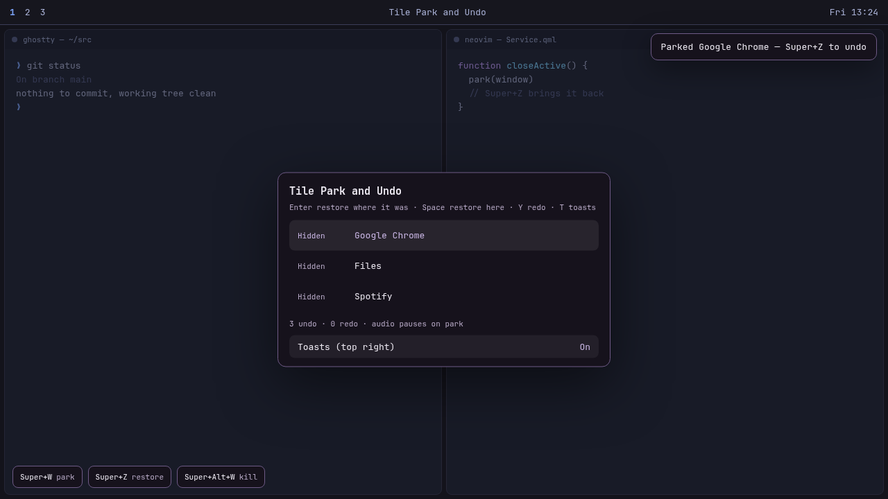

# Tile Park and Undo

For accidental Super+W on [Omarchy](https://omarchy.org/).

Stock `Super+W` kills the focused window. Hit it by mistake and that tile is
gone. Tile Park and Undo **parks** it instead: the app stays running on a
hidden stack of the last 10 closes, like minimize on a tiling compositor.
`Super+Z` brings the last one back. `Super+Y` parks it again. `Super+Alt+W`
is the real close.

This is **not** Ctrl+Z. Apps keep that for their own undo. Super+Z is only
for parked windows.



## Install

```sh
omarchy plugin add https://github.com/GreyforgeLabs/omarchy-desktop-undo.git --enable
```

Enabling the plugin does **not** edit Hyprland config. Super+W stays stock
kill until you opt in:

```sh
~/.config/omarchy/plugins/io.github.greyforgelabs.desktop-undo/bin/install-binds
```

That command is idempotent. It appends a marked block to
`~/.config/hypr/bindings.lua` (backup first) and reloads Hyprland. It refuses
to follow a symlink. You can paste the same binds by hand instead.

Requires Omarchy with Hyprland 0.56+, Python 3 (stdlib only), `hyprctl`,
`pactl`, and `busctl` — all present on a stock Omarchy install.

## Keys

| Shortcut | Action |
| --- | --- |
| `Super+W` | Close the focused window (parked, can undo) |
| `Super+Alt+W` | Close the focused window for real |
| `Super+Z` | Undo the last close |
| `Super+Y` | Redo |
| `Super+Shift+Z` | Timeline overlay |

`Super+Ctrl+Z` stays Omarchy's zoom-in. Apps keep ordinary Ctrl+Z.

In the timeline: **Enter** (or click) restores the selected window to the
workspace it left; **Space** restores it to the workspace you are on now;
**T** (or the Toasts row) turns the top-right toast on or off.

Park and restore skip Hyprland's window pop-in so they don't steal a beat
from the tiling layout.

The Omarchy keybinding viewer (`Super+K`) lists these after install.

## What undo can and cannot do

**Undoable**

- Windows you close with `Super+W` (process stays alive on `special:desktop-undo`)
- Best-effort: windows closed from the app's own close button, by relaunching the app

**Not undoable**

- Typing, edits, and anything inside an application (that's the app's Ctrl+Z)
- Workspace switches, moves, floats, and resizes (those would fill the stack)
- Steam/Proton games and Windows-path launchers
- Lock screen, screensaver, polkit, and other special workspaces

Parked windows keep their state: browser tabs and unsaved buffers stay.
Audio from that window is paused by default (PipeWire mute + matching MPRIS
pause) and resumed on restore. Chrome often shares one process across windows,
so parking one Chrome window may pause all Chrome audio. Set `pauseMediaOnPark`
to `false` if you want hidden YouTube to keep playing.

The oldest parked window is actually closed once the stack exceeds 10 so RAM
cannot grow without bound.

If the process died while it was parked, undo relaunches the app instead
(browser windows go through `omarchy-launch-browser`).

## Settings

On the plugin's `plugins[]` entry in `~/.config/omarchy/shell.json`:

| Key | Default | What it does |
| --- | --- | --- |
| `maxStack` | `10` | Undo depth, 1–20. Overflow closes the oldest parked window. |
| `trackAppClose` | `true` | Record title-bar closes as relaunch-only undo entries. |
| `pauseMediaOnPark` | `true` | Pause that window's audio when parking; resume on restore. |
| `showToast` | `true` | Top-right park/restore toast. Also toggled from the timeline (**T**). |

```sh
omarchy-shell io.github.greyforgelabs.desktop-undo status
```

## Why not Ctrl+Z?

Almost every editor, terminal, and browser already owns Ctrl+Z. A compositor
bind consumes the key before the app sees it. Passing it back with
`sendshortcut` retriggers the same bind and can lock the session.

Use Super+Z for the desktop, Ctrl+Z for the app.

## Remove

```sh
~/.config/omarchy/plugins/io.github.greyforgelabs.desktop-undo/bin/remove-binds
omarchy plugin remove io.github.greyforgelabs.desktop-undo
rm -f ~/.local/state/omarchy/desktop-undo.json
```

`remove-binds` deletes only this plugin's marked block so `Super+W` returns
to stock close. Parked windows on `special:desktop-undo` stay alive until you
Super+Alt+W them, or:

```sh
hyprctl clients -j | jq -r '.[] | select(.workspace.name=="special:desktop-undo") | .address' \
  | while read -r addr; do hyprctl dispatch "hl.dsp.window.close({ window = \"address:$addr\" })"; done
```

## Files and permissions

The plugin never requests elevated privileges. Enabling it writes nothing
outside the plugin checkout except:

- `~/.local/state/omarchy/desktop-undo.json` — toast on/off (created when you
  toggle **T** in the timeline)
- `~/.config/hypr/bindings.lua` — only if you run `install-binds` yourself

No network. Window identity is class/title/address from Hyprland's
in-process toplevel list, never process argv, and the plugin does not poll
`hyprctl`. `bin/media` may pause matching audio via PipeWire and MPRIS
using the window pid Hyprland already reports, with a 2s cap.

## Safety

- Super+W falls back to a real close if the shell is restarting
- Hidden-window cap (default 10)
- Re-entry guard so our own moves are not recorded as new closes
- Lock, screensaver, polkit, scratchpad, and other special workspaces are skipped

## License

MIT. See [LICENSE](LICENSE).
